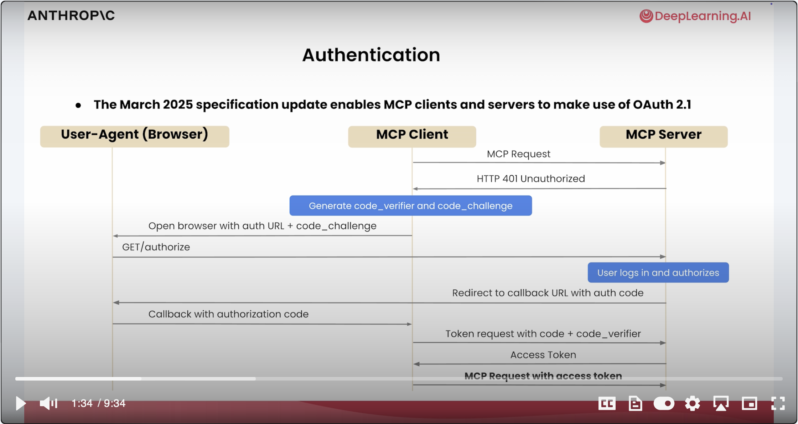
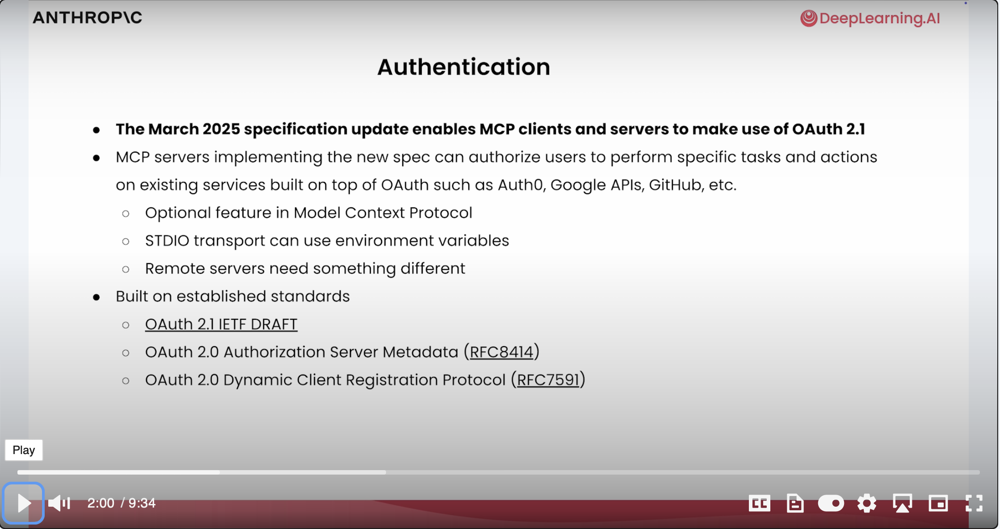
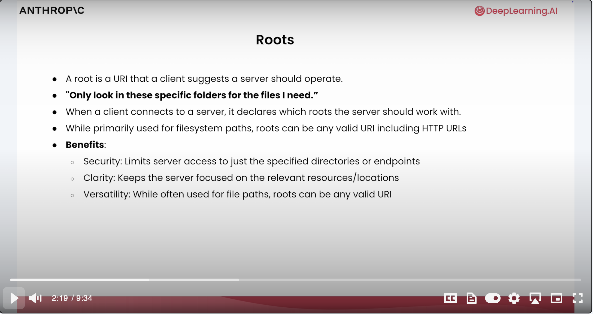
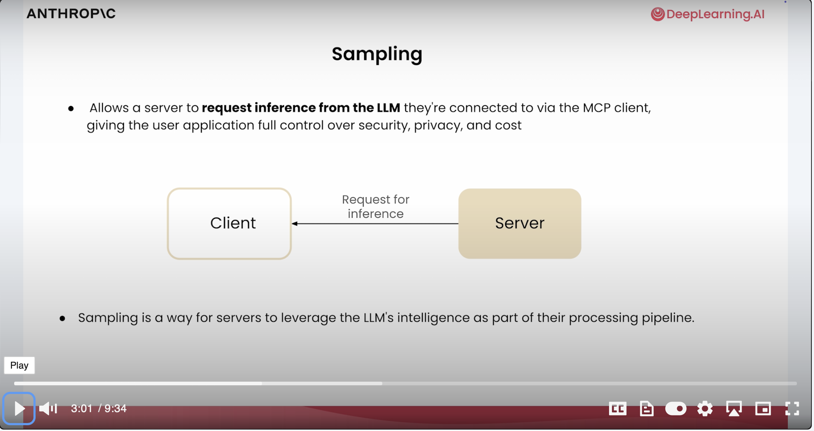
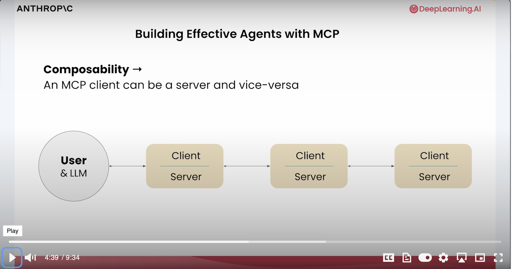
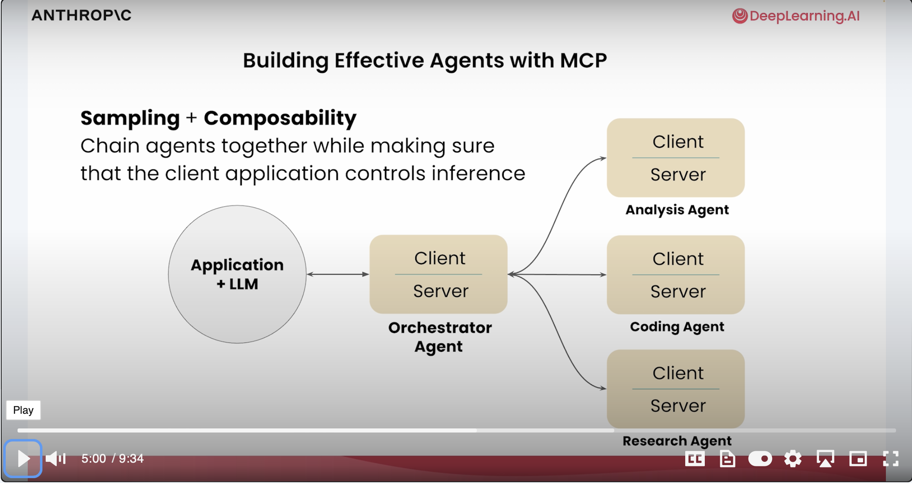
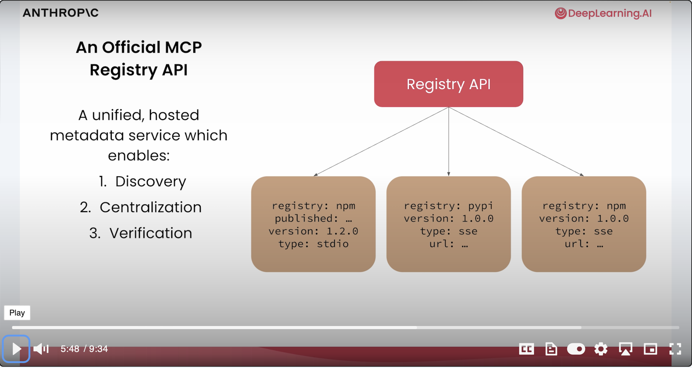
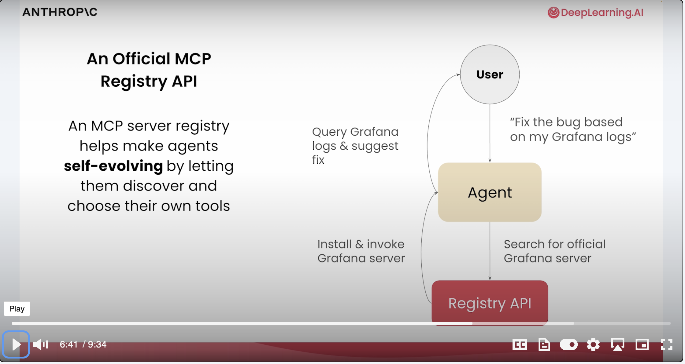
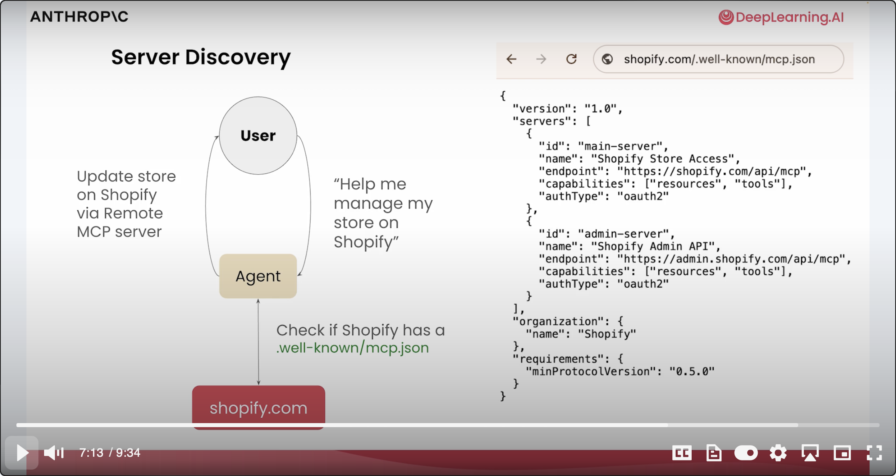
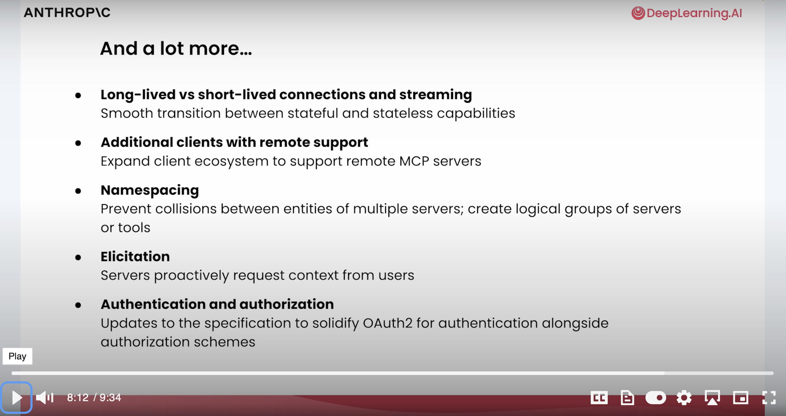

在本课程中，我们

- 学习了MCP的核心概念
- 构建了一个公开tools、resouce和prompt的MCP Server
- 开发了一个可以连接到多个MCP Sever的聊天机器人
- 使用CLaude Desktop构建更复杂的应用程序，并部署了自己的远程服务器

# 本课程没有涵盖的内容

本课程中，还有一些关于内容没有涵盖，分别是是MCP协议的身份认证、路由与根路径和采样。

## 1. OAUTH 2.1身份认证

2024年3月的MCP协议更新引入 **OAUTH 2.1** 作为远程服务器认证方案。OAUTH 2.1身份认证允许服务器鉴权，并允许客户端向数据源发送被认证的请求。

- 工作流程
  - 客户端请求 → 服务器要求身份验证 → 用户完成验证 → 交换令牌 → 客户端凭令牌向数据源发送认证请求。
  
- 特性
  - 认证过程属于**可选功能**（但远程服务器强烈推荐使用）。
  
  - 持续迭代开发中，持续增强安全性与功能。
  
    
  




## 2. 路由与根路径

- **路由定义**：客户端建议服务器操作的URI（如特定文件夹路径或HTTP URL）。
- 根路径功能：
  - **安全隔离**：限制服务器仅访问指定路径（如 `/data/logs`）。
  - **灵活性**：支持文件系统路径、HTTP URL等任意有效URI。
  - **场景价值**：避免全局暴露敏感路径，聚焦操作范围。
- **对比项**：标准IO通信无需此类认证，依赖环境变量即可。




## 3. 采样

- **核心能力**：大语言模型（LLM）可以向MCP Server发送请求，MCP Server也可以主动向LLM发起推理请求，这就是采样（Sampling）。

- 应用场景：

  > *示例：用户报告网站卡顿时，MCP服务器：*
  >
  > 1. 收集日志、性能指标；
  > 2. **直接请求LLM诊断**（而非将数据回传客户端）；
  > 3. 生成解决方案。

- 优势：

  - **安全边界**：避免敏感数据（如日志）暴露给客户端；
  - **效率提升**：减少上下文窗口传输负载。



# MCP 是多智能体世界的基石

## **递归架构**

- 核心特性：客户端与服务器角色可互换
  - 例：代理（Agent）既可接收应用请求，又能作为客户端连接其他MCP服务器
- 多代理架构：
  - 分析/编码/研究等场景可部署专用MCP服务器
  - 代理间通过MCP协议通信，形成链式服务（如：A代理 → B服务器 → C数据源）
- 统一注册表（关键更新）
  - 功能：
    - 标准化服务器发现机制
    - 验证服务器可信度（防恶意代码）
    - 管理服务器版本依赖
  - 必要性：解决如GitHub、Google Drive等平台大量第三方服务器的安全风险









## 动态发现机制

- **工作流示例**：
  用户需求 → 代理通过注册表查找目标服务器（如Shopify） → 读取其`MCP JSON`文件 → 获取端点/认证方式 → 用户授权后执行操作

- JSON文件定义：

  ```json
  {
    "endpoint": "https://api.shopify.com/mcp",
    "capabilities": ["fetch_orders", "update_inventory"],
    "authentication": "OAUTH2.1"
  }
  ```

- **冲突解决**：要求工具命名空间化（如`shopify.fetch_users` vs `crm.fetch_users`），避免指令歧义



# MCP未来发展路线

1. 协议进化方向

   - 增强HTTP流式传输支持
   - 推进状态管理与无状态能力平滑过渡
   
2. 开放生态号召

   - 鼓励开发者参与社区讨论、构建远程服务器
- 愿景：使MCP成为AI代理（Agents）的基础通信协议

