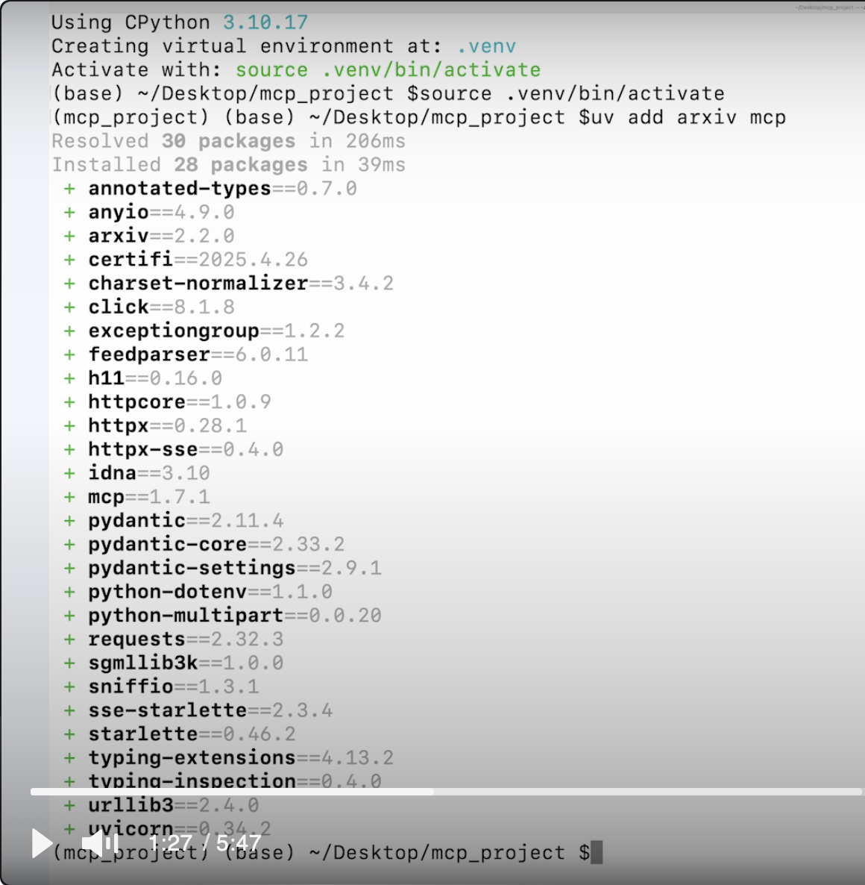
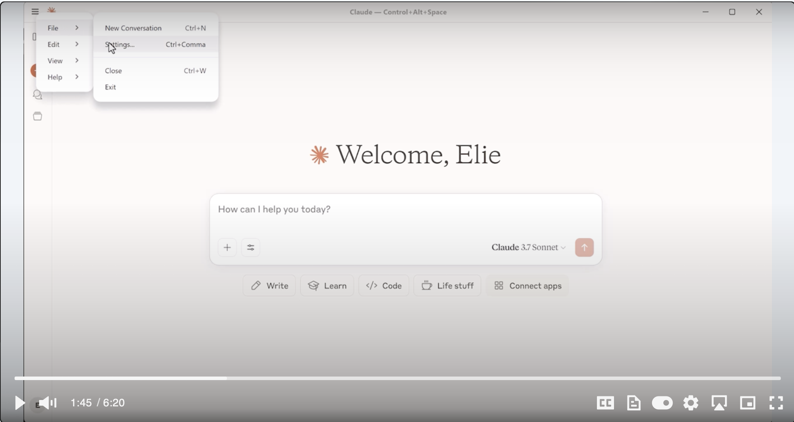
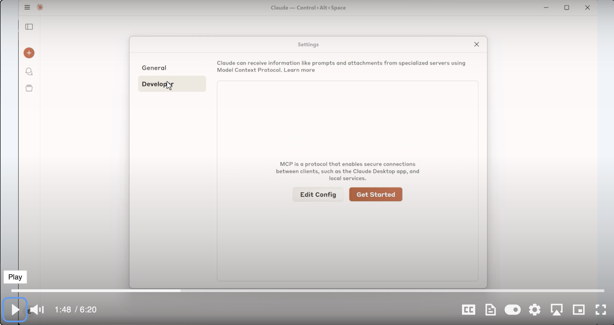
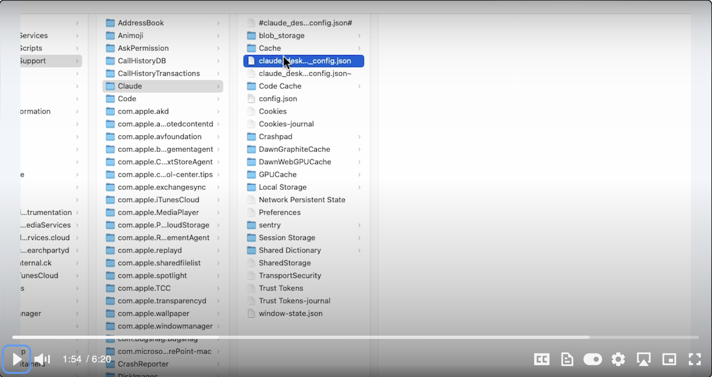
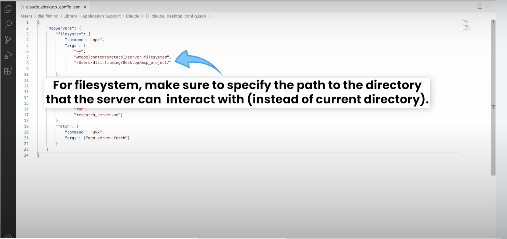
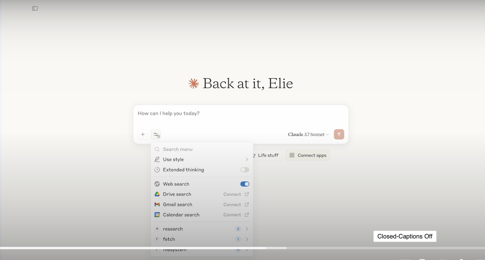
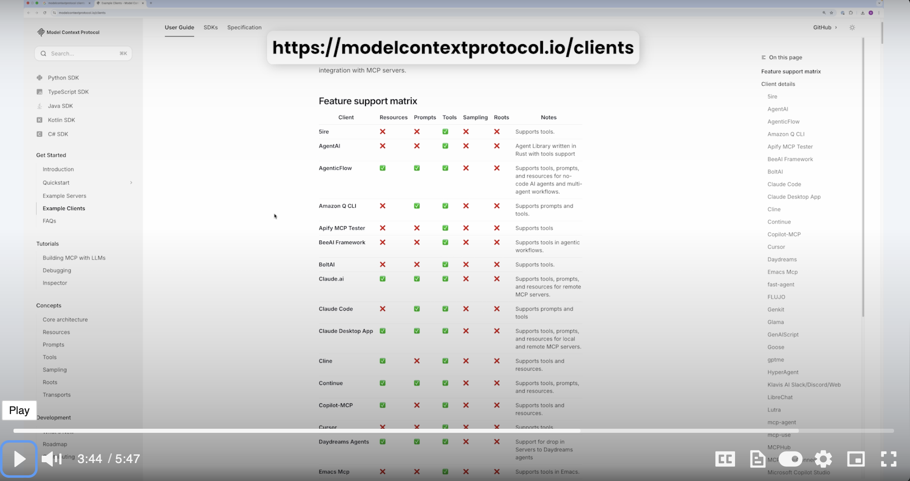
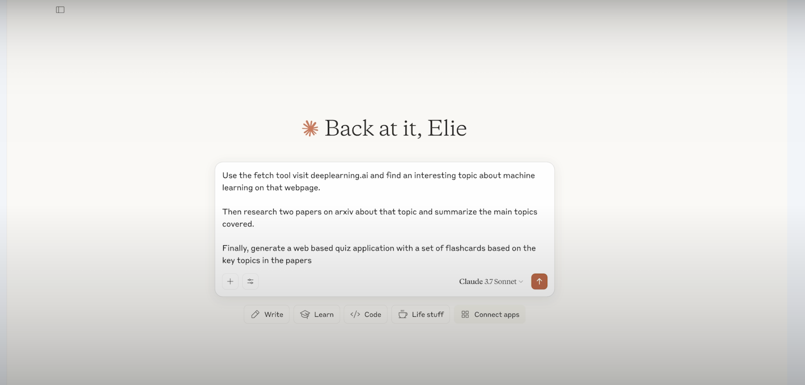
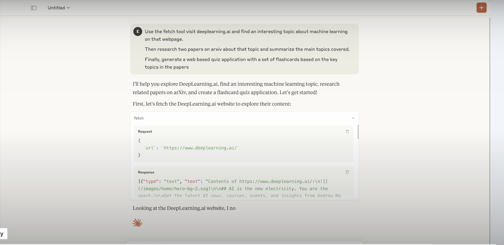
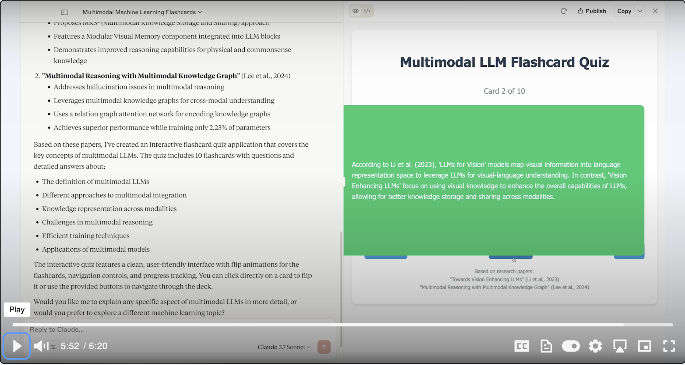

Claude桌面APP是MCP Client的一种，本节将学习如何使用Claude 桌面APP作为client连接MCP Server

# 配置Config

使用uv配置环境

打开Claude桌面APP，点击File->Settings

点击Developer->Edit Config

选中json文件

粘贴配置文件内容，保存

重启Claude桌面端，点击工具按钮，检查工具权限

除了Claude桌面端之外，可以在下面这个网站查到很多支持MCP集成的AI助手或其他工具，点击详情可以查看这些工具与MCP服务器交互的方式。在这个网页点击Claude Desktop可以查看Claude桌面端与MCP交互的具体操作方式。

# 测试

在输入框输入promt：

运行结果：

